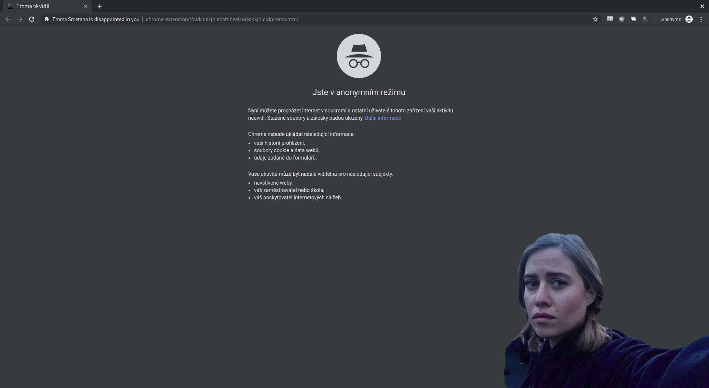

Emma is disappointed in you
===========================
This is a Chrome extension that will shame you upon opening incognito mode.

## Installation
I won't publish this on Chrome web store, so you'll have to install this the hard way.
1. Download this repository and unpack it somewhere
2. Open your Chrome, go to `chrome://extensions/` and enable developer mode
3. You should now see something like `Open unpacked` click that and navigate into where you unpacked this repository
4. The extension should load. Now click `Details` and enable running in incognito mode
5. That's it! Now you can open a new incognito window and feel bad about yourself

## How it looks
Don't want to go through the hassle of installing? Just look at the screenshot below:

